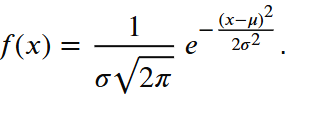

Windows
Создание venv
python -m venv venv

Активация venv
venv\Scripts\activate

ubuntu
source venv/bin/activate             

Для выбора виртуального окружения (venv) в VS Code нажмите Ctrl+Shift+P 
Select Interpreter

pip install numpy==2.3.5

Numba
Just-In-Time компилятор,
ускорение

pip install numba

https://habr.com/ru/companies/otus/articles/784068/

 декоратор @jit

 Декоратор @jit — сокращение от Just-In-Time, что означает компиляцию "прямо на лету". С помощью @jit вы можете указать Numba компилировать определенную функцию, превращая её в молниеносный машинный код.

 Numba имеет несколько параметров для тонкой настройки поведения @jit:

cache: Если установлено в True, Numba будет кэшировать скомпилированный код, что ускорит его выполнение при последующих запусках.

Кэширование полезно для функций, которые вызываются многократно с одинаковыми типами данных (весь код будет с замером time, можете сравнить с ванильным питоновским кодом):

nogil: При установке в True позволяет функции выполняться без GIL Python, что может быть полезно для многопоточных приложений:

parallel: Если установлено в True, Numba попытается автоматически распараллелить циклы в функции:

Функция square помечена декоратором @njit(inline='always'), что указывает numba всегда инлайнить эту функцию в любую другую функцию, которая её вызывает. Когда мы вызываем sum_of_squares, numba компилирует эту функцию, автоматически инлайня функцию square прямо в цикл

@njit(inline='always')  # Используем inline='always' для инлайнинга функции
def square(x):
    return x * x

# определяем основную функцию, которая использует функцию square
@njit

Чем точнее вы определите типы данных в вашей функции, тем лучше Numba сможет её оптимизировать. Глобальные переменные могут замедлить оптимизацию, так как Numba не всегда может точно определить их типы и значения.

@vectorize
Векторизация — это процесс преобразования алгоритмов таким образом, чтобы они обрабатывали не один элемент данных за раз, а целые блоки. Это позволяет использовать возможности всех процессоров для параллельной обработки данных, что оч. бустит процесс выполнения.

Декоратор @vectorize в намбе позволяет создавать векторизованные функции, которые работают как универсальные функции NumPy (ufuncs). Это означает, что вы можете писать функции на чистом питоне, а затем намба скомпилирует их в высокопроизводительные машинные инструкции, которые автоматически работают с массивами данных.

@vectorize([float64(float64, float64)])

# определяем функцию с несколькими сигнатурами для разных типов данных
@vectorize(['int32(int32, int32)', 'int64(int64, int64)', 'float32(float32, float32)', 'float64(float64, float64)'])

@generated_jit
@generated_jit позволяет создавать функции, генерирующие специализированный код в зависимости от типов входных аргументов. В отличие от обычного @jit, который просто компилирует функцию для заданных типов данных, @generated_jit позволяет написать свою логику для выбора или генерации кода в зависимости от типов аргументов во время выполнения.

Когда вы вызываете функцию, декорированную @generated_jit, намба вызывает генератор функции — это ваш код, который определяет, какая версия функции должна быть скомпилирована и выполнена на основе типов аргументов. Это позволяет писать очень гибкие и оптимизированные функции.
@generated_jit
def smart_function(x):
    if isinstance(x, types.Integer):
        # Врсия функции для целых чисел
        def int_version(x):
            return x * 2
        return int_version
    elif isinstance(x, types.Float):
        # Версия функции для чисел с плавающей точкой
        def float_version(x):
            return x / 2
        return float_version

@stencil
@stencil позволяет определять функции, которые автоматически применяются к каждому элементу массива с учетом его соседей. Оч.полезно для операций, которые зависят от локального контекста в массиве, например, для фильтрации или свертки.

С@stencil, вы определяете ядро— небольшую функцию, которая описывает вычисление на одном элементе и его соседях. Numba затем автоматически применяет это ядро ко всем элементам входного массива, создавая новый массив с результатами.

Допустим, мы хотим применить простой фильтр Собеля для выделения границ на изображении. Фильтр Собеля — это операция свертки, которая использует два ядра, одно для горизонтальных изменений, другое для вертикальных.

sobel_kernel определяет, как каждый пиксель изображения должен быть изменен на основе значений его соседей. @stencil автоматически обрабатывает границы и применяет это ядро ко всем пикселям входного изображения.

import numpy as np
from numba import stencil

# функциюя фильтра Собеля
@stencil
def sobel_kernel(a):
    return (a[-1, -1] - a[1, -1]) + 2 * (a[-1, 0] - a[1, 0]) + (a[-1, 1] - a[1, 1])

# сздаем тестовое изображение (массив)
image = np.random.rand(100, 100)

# фильтр Собеля
filtered_image = sobel_kernel(image)

# Результат — новый массив с примененным фильтром
print(filtered_image)

prange
numba.prange (parallel range) — это функция в Numba, используемая внутри JIT-компилируемых функций с parallel=True для явного распараллеливания циклов, работающая аналогично OpenMP. Она автоматически распределяет итерации цикла между потоками, позволяя ускорить вычисления на многоядерных процессорах. Использование prange требует независимости итераций друг от друга. 
Основные особенности:
Использование: Применяется вместо стандартного range в функциях с @jit(parallel=True).
Параллелизм: Указывает Numba, что цикл можно выполнить параллельно.
Ограничения: Итерации цикла должны быть независимыми (не иметь конкуренции за данные). 

from numba import jit, prange
import numpy as np

@jit(parallel=True)
def parallel_sum(a, b):
    res = np.empty(a.shape[0])
    # prange позволяет параллельно выполнять итерации
    for i in prange(a.shape[0]):
        res[i] = a[i] + b[i]
    return res

    Каждый канал выравниваем 

    делатация и эрозия в чб

    обычгле изображение RGB
    openCV GBR

    delatation

    max

    errosion 

    min

    -1 0 1

    чтобы найти углы

    по краям 0

    по нраям креста -1
    по центру 5 повышает резкость

    Открытие (Opening): Эрозия -> Дилатация. Убирает шум и мелкие объекты, не сильно уменьшая крупные.

Закрытие (Closing): Дилатация -> Эрозия. Заполняет маленькие дырочки внутри объектов.

erode
Эрозия или сужение. Данная операция представляет собой логическую 
операцию коньюнкции. То есть если на исходном изображении в окрестности 
точки, в том числе и она сама, все пиксели равны 1, то данная точка на 
выходном изображении будет равна 1, если нет то 0. Данная операция 
позволяет убрать лишние одиночные пиксели на изображении, полученные 
после бинаризации

dilate
Дилатации(расширение). Данная функция представляет собой 
логическую операцию дизьюнкции, то есть если на исходном изображении в 
окрестности точки, хотябы один пиксель равен 1, то данная точка на выходном 
изображении принимает значение 1, если нет, то 0. Данная функция позволяет 
востановить пексели внутри объектов, или части границ, которые были 
потерены в следствии бинаризации.

.ravel() метод numpy который разварачивает многомерный массив в одномерный

np.bincount() 
np.histogram()
np.argmax(hist_histogram)

values, bin_edges, patches = hist(img_stretched.ravel(), bins=range(256))

Строчные $\sum_{i=1}^{n} i = \frac{n(n+1)}{2}$

Блочные
$$\int_{a}^{b} f(x) \,dx$$

Формула плотности: 

Правило трех сигм: Примерно 68% значений находятся в пределах 
, 95% — в пределах 
, и 99,7% — в пределах 
 от среднего.

 cv2.filter2D

просто производная 

[[-1, -1, -1], [0, 0, 0], [1, 1, 1]]

метода Канни выделяет контура на основе производных

Собель - найти производные

[[-1, -2, -1], [0, 0, 0], [1, 2, 1]]

Руководство по оформлению Markdown файлов
https://gist.github.com/Jekins/2bf2d0638163f1294637

LaTeX

https://devhops.ru/latex/symbols/#rel

David G. Lowe. "Distinctive image features from scale-invariant keypoints.” IJCV 60 (2), pp. 91-110, 2004
https://www.cs.ubc.ca/~lowe/papers/ijcv04.pdf