# Computer_vision_labs
#  Лабораторная работа 1

[Файл Lab1_CV/Lab1_CV_final.ipynb](./Lab1_CV/Lab1_CV_final.ipynb)

### 1. Фильтры 

Для применения фильтра к изображению, предварительно необходимо его расширить, чтобы после применения фильтра оно сохранило исходный размер

Применение фильтра к изображению - операция свёртки

Обычно ядро свёртки (матрица, обычно квадратная с коэффициентами ядра) последовательно накладывается на расширенное изображение. Все значения изображения, которые в данной позициии закрывает ядро свёртки домножаются на значения на соответствующих позициях ядра свёртки, затем суммируются и записываются в пиксель результирующего изображения, соответствующий центральному прикселю ядра свёртки

#### 1.1 Медианный фильтр

Ядро свёртки 

Выбор медианы из выборки пикселей по окрестности данного

=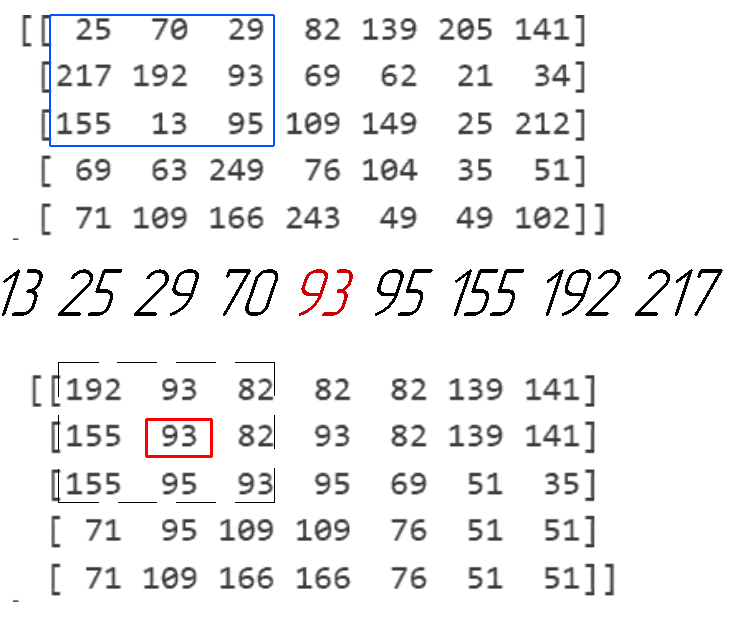
  
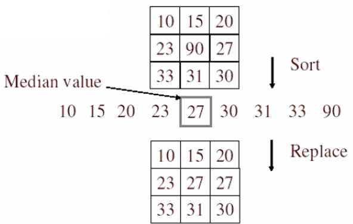

#### 1.2 Фильтр гаусса

Двумерное распределение Гаусса
$$g(x,y)=\frac{1}{2\pi\sigma^2}  {e}^{-\frac{x^2+y^2}{2\sigma^2}} $$
Значения x и y это значения индесов элементов матрицы фильтра гаусса, при условии, что центральный элемент имеет индексы (0, 0)

Подствавляя для каждой клетки значение функции определяем значения коэффициентов в каждой ячейки, а затем их номализуем, чтобы сумма всех элементов ядра свёртки равнялся 1.

$$filtersize = 3 $$

$$\sigma = 0,3 $$

Распределение значений координат в ядре

Подставляем значения в распределение Гаусса

Находим сумму

Нормализцем к единичной сумме (путём деления всех значений на неё)

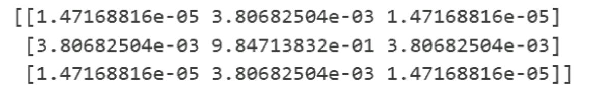

расширяем исходное изображение выделяем область

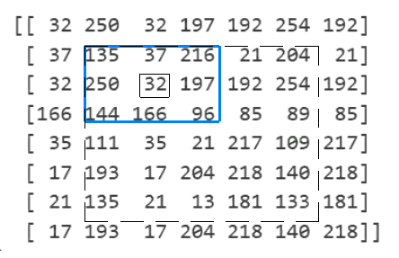

перемножаем поэлементно на ядро

перемножаем находим сумму элементов

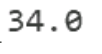

записываем в соответствующую ячейку

### 2. Морфологические операции
#### 2.1 Эрозия
erode
Эрозия или сужение. 
Если все элементы попавшие в фильтр равны единице, то результат равен 1, иначе 0

Исходное бинаризованное изображение

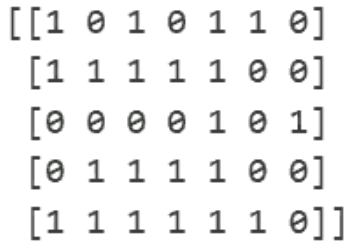

Расширенное бинаризованное изображение

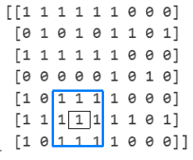
Результат

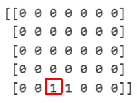

#### 2.2 Дилатация

dilate
Дилатации(расширение). 
Если хотя бы один элемента в окне фильтра равен единице, то результат равен 1 иначе 0

Исходное бинаризованное изображение

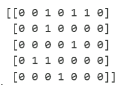
Расширенное бинаризованное изображение

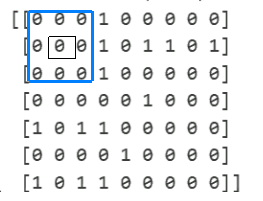
Результат

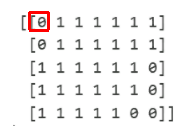

### 3. Прочие операции
#### 3.1 пороговая бинаризация (для rgb и grayscale изображения)
Перевод каждогот элемента изображения в двоичный формат, если значение элемента больше порога, то результат 1 иначе 0

Порого 190

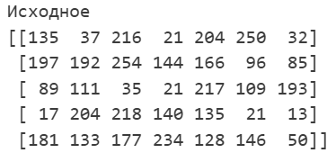

Результат 

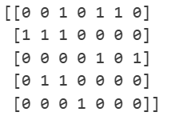

#### 3.2 выравнивание гистограммы

Ищем распределение яркостей пикселей на всём изображении
находим макимум берём заданный интервал яркостей от наиболее часто втречающегося в положительную и отрицательную сторону. Затем всё, что выходит за интервал приравниваем к значению границы, а затем масштабируем и растягиваем так, чтобы минимальная яркость урезанного диапазона соответствовала 0, а максимальная 255

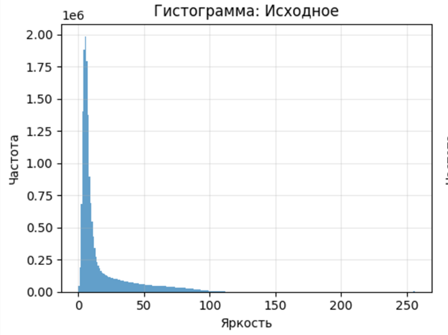

порог в 2 стороны 50 значений от максимума

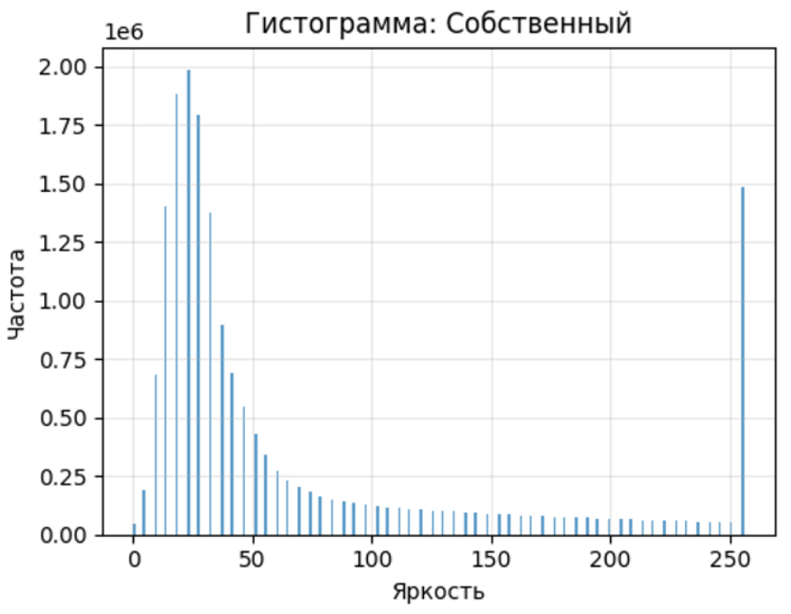

#### 3.3 поворот изображений на угол кратный 90 градусов
Если угол кратен 90 град. То меняем ширину и высоту изображения местами

Левый верхний угол при вращении против часовой стрелки переносим вниз-вправо-вверх-влево (90 180 270 360 град) и переносим остальные пиксели изображения на новое изображение

> callout