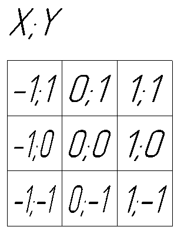
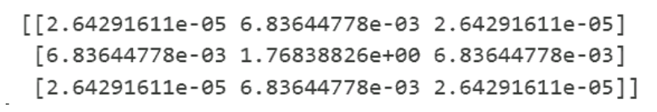
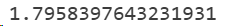
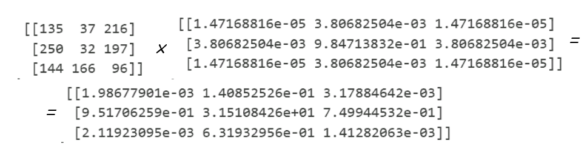
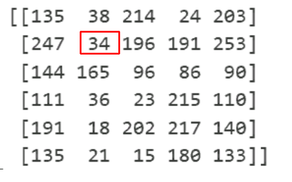

# Computer_vision_labs
#  Лабораторная работа 1

[Файл Lab1_CV/Lab1_CV_final.ipynb](./Lab1_CV/Lab1_CV_final.ipynb)

### 1. Фильтры 

Для применения фильтра к изображению, предварительно необходимо его расширить, чтобы после применения фильтра оно сохранило исходный размер

Применение фильтра к изображению - операция свёртки

Обычно ядро свёртки (матрица, обычно квадратная с коэффициентами ядра) последовательно накладывается на расширенное изображение. Все значения изображения, которые в данной позициии закрывает ядро свёртки домножаются на значения на соответствующих позициях ядра свёртки, затем суммируются и записываются в пиксель результирующего изображения, соответствующий центральному прикселю ядра свёртки

#### 1.1 Медианный фильтр

Ядро свёртки 

Выбор медианы из выборки пикселей по окрестности данного

=
  

#### 1.2 Фильтр гаусса

Двумерное распределение Гаусса
$$g(x,y)=\frac{1}{2\pi\sigma^2}  {e}^{-\frac{x^2+y^2}{2\sigma^2}} $$
Значения x и y это значения индесов элементов матрицы фильтра гаусса, при условии, что центральный элемент имеет индексы (0, 0)

Подствавляя для каждой клетки значение функции определяем значения коэффициентов в каждой ячейки, а затем их номализуем, чтобы сумма всех элементов ядра свёртки равнялся 1.

$$filtersize = 3 $$

$$\sigma = 0,3 $$

Распределение значений координат в ядре

Подставляем значения в распределение Гаусса

Находим сумму

Нормализцем к единичной сумме (путём деления всех значений на неё)

расширяем исходное изображение выделяем область

перемножаем поэлементно на ядро

перемножаем находим сумму элементов

записываем в соответствующую ячейку

### 2. Морфологические операции
#### 2.1 Эрозия
erode
Эрозия или сужение. Данная операция представляет собой логическую 
операцию коньюнкции. То есть если на исходном изображении в окрестности 
точки, в том числе и она сама, все пиксели равны 1, то данная точка на 
выходном изображении будет равна 1, если нет то 0. Данная операция 
позволяет убрать лишние одиночные пиксели на изображении, полученные 
после бинаризации

#### 2.2 Дилатация

dilate
Дилатации(расширение). Данная функция представляет собой 
логическую операцию дизьюнкции, то есть если на исходном изображении в 
окрестности точки, хотябы один пиксель равен 1, то данная точка на выходном 
изображении принимает значение 1, если нет, то 0. Данная функция позволяет 
востановить пексели внутри объектов, или части границ, которые были 
потерены в следствии бинаризации.
### 3. Прочие операции
#### 3.1 пороговая бинаризация (для rgb и grayscale изображения)
#### 3.2 выравнивание гистограммы
#### 3.3 поворот изображений на угол кратный 90 градусов
