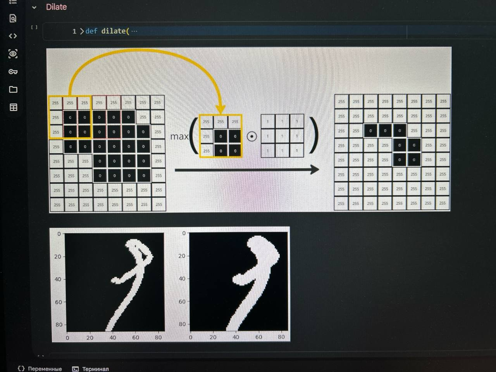

4 Обязательные лаб. работы:
1) Базования преобработка изображений
2) Визуальная одометрия
3) Видеослежение
4) MNIST/CIFAR10/ или любой аналог - классификация изображений >4 классов предсказания (можно например дорожные знаки взять) при помощи CNN
Лаб работа на доп. баллы:
5) Создать свой датасет с лицами и выполнить классификацию мужчина/женщина или классификацию эмоции на лице.

Доп материалы:
- https://colab.research.google.com/drive/1KqXOyR2o_65LCB59JrqwHbNEYqZF6nRG
- Файл с методичкой (из неё брать 1-3 лабы)

Для 1 лаб работы по CV необходимо реализовать базовый минимум операций над изображениями
Входное изображение в формате (RGB, не чёрно-белое)
1. Фильтры
1.1 Медианный фильтр
1.2 Фильтр гаусса
2. Морфологические операции
2.1 Эрозия
2.2 Дилатация
3. Прочие операции
3.1 пороговая бинаризация (для rgb и grayscale изображения)
3.2 выравнивание гистограммы
3.3 поворот изображений на угол кратный 90 градусов

Использовать методы OpenCV для реализации операций нельзя. Допустимы только методы cv2.imread() и cv2.imshow(). Все методы должны быть реализованы вручную.

Начиная с 3 лаб работы допустимо использование реализованных в предыдущих работах методов, но не более.

Все лаб. Работы должны быть сопровождены единым репозиторием с readme.md файлом (в котором будет ваш отчёт по сути) и визуальным отображением проводимых операций. Основную часть описания преобразований необходимо показывать на уровне работы с пикселями, а не в виде текста. (Пример показывал на паре, фотку как это выглядит приложил.)

Для операции дилатации достаточно показать подобные 2 изображения и быть способным объяснить как это работает используя свои рисунки из отчёта. Если рисунка будет недостаточно для объяснения, то нужно будет показать эти матричные операции на листке бумаги на месте, потому советую оформить картинки заранее.